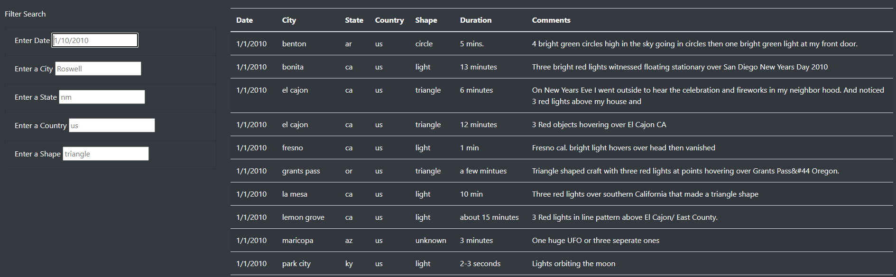

# UFOs

## Overview

The purpose of this project was to build a simple website to display a brief article about UFO sightings and a table with details about reported sightings.  The table contains columns for Date of the sighting, the city, state, and country in which it occured, the shape of the object seen, the duration of the sighting, and a brief comment describing the event.  

## Results

On the page, I included multiple input boxes that a person visiting the page can use to specify a date, city, state, country, or object shape, or any combination of those details they would like to search for within the table.  I used JavaScript to create a script that will filter the table to only sightings matching the parameters the user specifies.  This image shows what the table and filters look like with no input:

