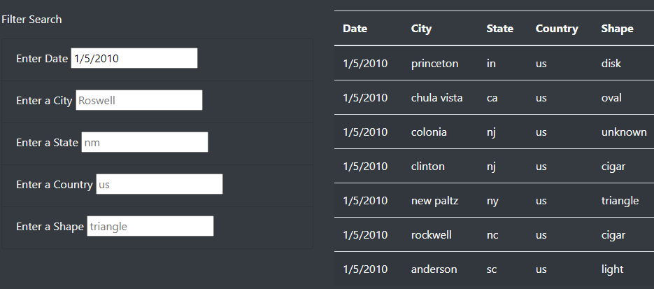
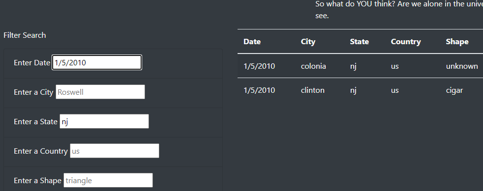
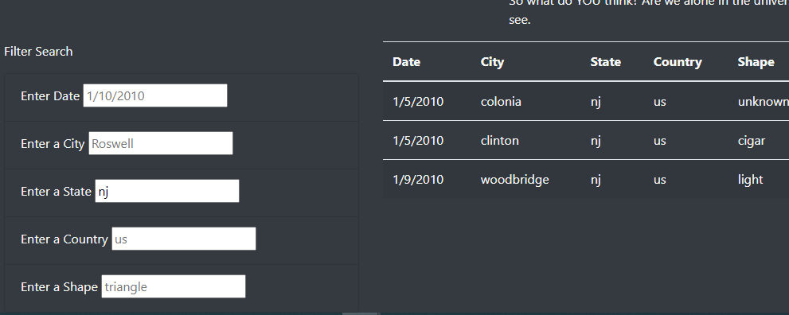

# UFOs

## Overview

The purpose of this project was to build a simple website to display a brief article about UFO sightings and a table with details about reported sightings.  The table contains columns for Date of the sighting, the city, state, and country in which it occured, the shape of the object seen, the duration of the sighting, and a brief comment describing the event.  

## Results

On the page, I included multiple input boxes that a person visiting the page can use to specify a date, city, state, country, or object shape, or any combination of those details they would like to search for within the table.  I used JavaScript to create a script that will filter the table to only sightings matching the parameters the user specifies.  This image shows what the table and input boxes look like with no input:

The boxes display sample inputs to demonstrate to the user the format they need to use for their searches.

When a user enters a search parameter in one of the boxes and presses enter, the table is filtered to only rows matching that parameter, as seen in the below image with the date specified as 1/5/2010:

The user can filter on multiple criteria by inputing in two boxes, as seen here where a filter is added to the above version for state:

Now, the table displays only rows where the date matches the specified 1/5/2010 and the state matches the specified nj.

If the user wished to instead search for all sightings in New Jersey, not just those on 1/5/2010, they could delete the date specified in the date filter box, press enter again, then the table would only filter for state, as seen here:

## Summary

This webpage design is simple and effective at allowing the user to find and read UFO sightings based on their desired search criteria, however it could be developed further.

One drawback of the design thus far is that nothing is returned if the user's search parameters are not matched in the table.  For instance, if the user wants to filter to a date on which there are not recording sightings, the site will display an empty table and nothing more.  Similarly, if the user was to misspell a search term, such as city name, the site would display an empty table even if their was a record matching the city the user intended.  This lack of any information about why no search results are displayed can be frustrating and confusing for the user.

To improve upon this shortcoming, code could be added to the script to raise errors and display a message on the site if the search terms used do not match the table.  For instance if the user searches for a date not included in the full table, an error could be raised and some sort of 'date out of range' message could be displayed to the user.

Another possible improvement could be the addition of a filter for the sighting duration.  Because the durations in this column are so varied, the filter would need to be more complex, perhaps grouping the times into a ranges and matching a users search to any sightings that fall in that range.

